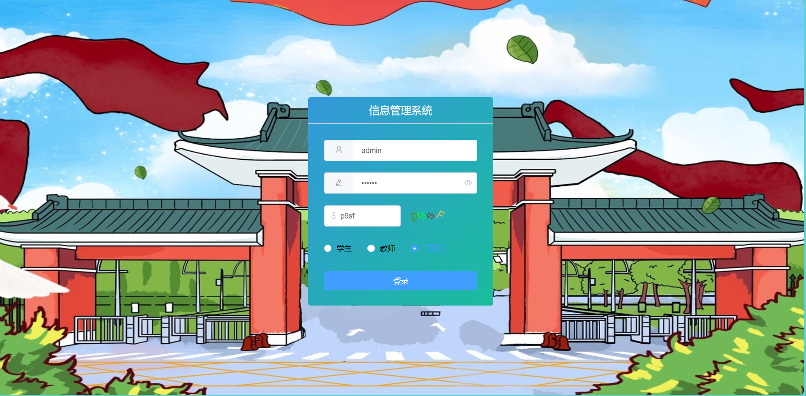
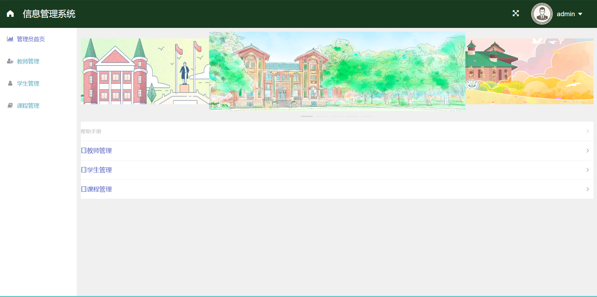
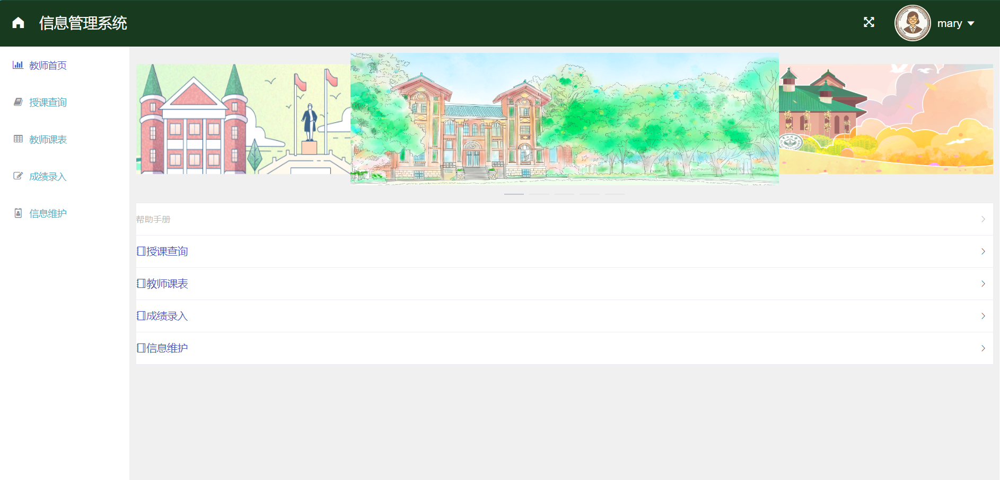
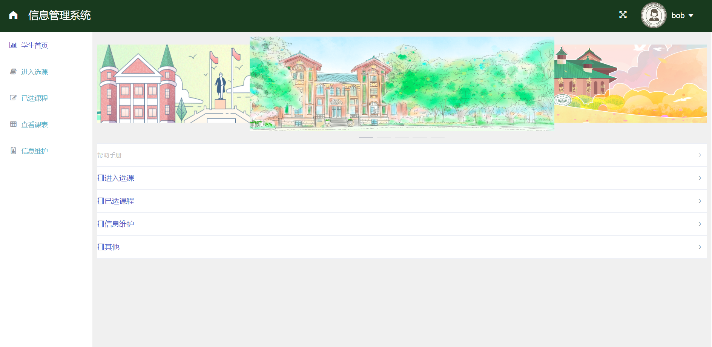

# liaofy-linzhy-course-select-system
This course selection system project is a final project for the database course at Sun Yat sen University.

### requirement:

```txt
vue   5.0.8
java  17.0.7
mysql 8.0.33
```

### prepare database

- If you want to deploy this project locally, you need to first install the MySQL database and set the account name and password to `root` and `123456`. Then create a database `database_hw`, and execute `course-system-mysql.sql` in the directory `deploy` to generate the corresponding database table.

#### deploy springboot project

- Run `java -jar course-system-0.0.1-SNAPSHOT.jar` on your server. This file is also located in the directory `deploy`.

#### deploy web front-end

- Place the `dist` folder under the deploy folder in the `nginx/html` folder and ensure that the Nginx server is running. Then modify the configuration file `nginx/conf/nginx.conf` to configure your preferred access IP and port, **but the backend interface must be configured as `8085`**.Then you run `python nginx.exe` under the nginx directory.


Finally you can access the web application course-system.

you can use username：**admin**  and password：**123456** to login in.









